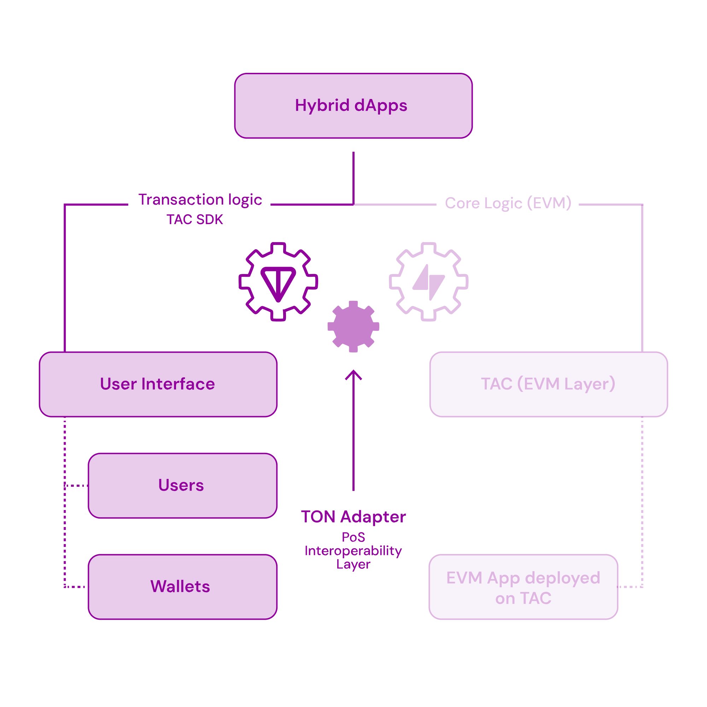

# TacSdk 

[](https://www.npmjs.com/package/@tonappchain/sdk)
[](https://www.npmjs.com/package/@tonappchain/sdk)
[](https://runkit.com/npm/@tonappchain/sdk)


The TAC SDK makes it possible to create hybrid dApps that let TON users interact directly with EVM smart contracts without needing to manage multiple wallets or understand the complexities of cross-chain messaging.

### Documentation

For full documentation and examples, please visit [TAC SDK Documentation](https://docs.tac.build/build/sdk/introduction).

### Installation

```bash
npm install @tonappchain/sdk
```

or 

```bash
yarn add @tonappchain/sdk
```


## Features

The TAC SDK enables you to create frontends that:

- Connect to TON wallets like Tonkeeper or Tonhub
- Send transactions from TON to your EVM contracts
- Track cross-chain transaction status in real-time
- Handle tokens across both chains
- Create a seamless user experience for TON users




## Available Resources


### SDK Components

- **[`TacSdk`](./docs/sdks/tac_sdk.md)**: The main class for interacting with the TAC protocol.
  - [`create`](./docs/sdks/tac_sdk.md#create-static): Initializes the SDK instance.
  - [`sendCrossChainTransaction`](./docs/sdks/tac_sdk.md#sendcrosschaintransaction): Sends a cross-chain transaction from TON to TAC.
  - [`getEVMTokenAddress`](./docs/sdks/tac_sdk.md#getevmtokenaddress): Gets the TAC address for a TON token.
  - [`getTVMTokenAddress`](./docs/sdks/tac_sdk.md#gettvmtokenaddress): Gets the TON address for a TAC token.
  - [`getTransactionSimulationInfo`](./docs/sdks/tac_sdk.md#simulatetacmessage): Performs a complete simulation of a crosschain transaction to estimate fees and gather execution-related metadata.  
  - [`getUserJettonBalance`](./docs/sdks/tac_sdk.md#getuserjettonbalance): Gets a user's Jetton balance (raw).
  - [`getUserJettonBalanceExtended`](./docs/sdks/tac_sdk.md#getuserjettonbalanceextended): Gets extended Jetton balance info (including decimals).
  - [`getUserJettonWalletAddress`](./docs/sdks/tac_sdk.md#getuserjettonwalletaddress): Calculates a user's Jetton wallet address.
  - [`nativeTONAddress (getter)`](./docs/sdks/tac_sdk.md#nativetonaddress-getter): Placeholder address for native TON.
  - [`nativeTACAddress (getter)`](./docs/sdks/tac_sdk.md#nativetacaddress-getter): Gets the native asset address on the TAC chain.
  - *(See file for more...)*

- **[`OperationTracker`](./docs/sdks/operation_tracker.md)**: Tools for monitoring cross-chain operation status.
  - [`constructor`](./docs/sdks/operation_tracker.md#constructor): Creates a tracker instance.
  - [`getOperationId`](./docs/sdks/operation_tracker.md#getoperationid): Retrieves the Operation ID from a `TransactionLinker`.
  - [`getStageProfiling`](./docs/sdks/operation_tracker.md#getstageprofiling): Gets detailed timing and status for all stages of an operation.
  - [`getSimplifiedOperationStatus`](./docs/sdks/operation_tracker.md#getsimplifiedoperationstatus): Gets a simplified overall status (Pending, Successful, Failed, Not Found).
  - *(See file for more...)*

- **[`Senders`](./docs/sdks/senders.md)**: Handles signing and sending TON transactions.
  - [`TonConnectSender`](./docs/sdks/senders.md#tonconnectsender): Implements sending via TonConnect UI.
  - [`RawSender`](./docs/sdks/senders.md#rawsender): Implements sending using a raw private key.

- **[`Utilities`](./docs/sdks/utilities.md)**: Helper functions and interfaces.
  - [`startTracking`](./docs/sdks/utilities.md#starttracking): Utility function to poll and log operation status to the console.

### Data Models

- **[`Enums`](./docs/models/enums.md)**: Key enumerations used by the SDK.
  - [`Network`](./docs/models/enums.md#network): `TESTNET` or `MAINNET`.
  - [`SimplifiedStatuses`](./docs/models/enums.md#simplifiedstatuses): `PENDING`, `FAILED`, `SUCCESSFUL`, `OPERATION_ID_NOT_FOUND`.
  - [`OperationType`](./docs/models/enums.md#operationtype): Detailed operation types (`PENDING`, `TON_TAC_TON`, `ROLLBACK`, etc.).
  - [`StageName`](./docs/models/enums.md#stagename): Identifiers for tracking stages (`COLLECTED_IN_TAC`, `EXECUTED_IN_TAC`, etc.).

- **[`Structs`](./docs/models/structs.md)**: Core data structures.
  - [`AssetBridgingData`](./docs/models/structs.md#assetbridgingdata): Specifies assets to bridge (TON or Jettons).
  - [`EvmProxyMsg`](./docs/models/structs.md#evmproxymsg): Defines the target EVM call details.
  - [`TransactionLinker`](./docs/models/structs.md#transactionlinker): Identifies a cross-chain operation.
  - *(See file for more...)*

Navigate through the linked files for full details on parameters, return types, examples, and more.